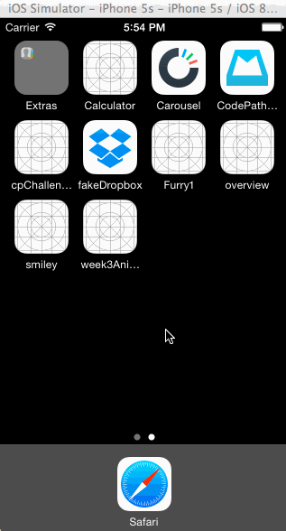

# mailbox

CodePath assignment - Recreate mailbox visual flow using UIView Animations and gestures.

Time spent: 10 hours spent in total

Completed user stories:
<ul>
<ul>
<li>On dragging the message left...

<ul>
<li>Initially, the revealed background color should be gray.</li>
<li>As the reschedule icon is revealed, it should start semi-transparent and become fully opaque. If released at this point, the message should return to its initial position.</li>
<li>After 60 pts, the later icon should start moving with the translation and the background should change to yellow.

<ul>
<li>Upon release, the message should continue to reveal the yellow background. When the animation it complete, it should show the reschedule options.</li>
</ul></li>
<li>After 260 pts, the icon should change to the list icon and the background color should change to brown.

<ul>
<li>Upon release, the message should continue to reveal the brown background. When the animation it complete, it should show the list options.</li>
</ul></li>
</ul></li>
<li>User can tap to dismissing the reschedule or list options. After the reschedule or list options are dismissed, you should see the message finish the hide animation.</li>
<li>On dragging the message right...

<ul>
<li>Initially, the revealed background color should be gray.</li>
<li>As the archive icon is revealed, it should start semi-transparent and become fully opaque. If released at this point, the message should return to its initial position.</li>
<li>After 60 pts, the archive icon should start moving with the translation and the background should change to green.

<ul>
<li>Upon release, the message should continue to reveal the green background. When the animation it complete, it should hide the message.</li>
</ul></li>
<li>After 260 pts, the icon should change to the delete icon and the background color should change to red.

<ul>
<li>Upon release, the message should continue to reveal the red background. When the animation it complete, it should hide the message.</li>
</ul></li>
</ul></li>
<li>Optional: Panning from the edge should reveal the menu

<ul>
<li>Optional: If the menu is being revealed when the user lifts their finger, it should continue revealing.</li>
<li>Optional: If the menu is being hidden when the user lifts their finger, it should continue hiding.</li>
</ul></li>

</ul>

</ul>

Walkthrough of all user stories:

